# Create your initial document
Please use this step-by-step guide to create your first page. 
In this activity, you will :
- clone a repository to your local machine
- create a branch of the main repository
- create new content
- commit your changes to remote branch
- create a pull request

After creating pull request, you may intimate the repository maintainer.
He/She can merge your updates to the parent/main branch.

## Steps
1. Open a browser and login to github.com with your username and password.
2. On the home page, click the drop-down arrow next to your profile name and click the organization name `bcablr2021`
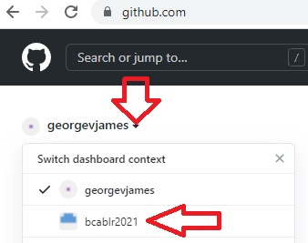
3. Next, click on the repository name `general`
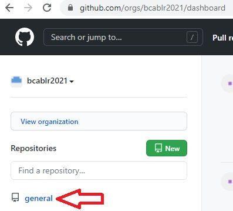
4. In the next page, click on the `code` button and then click `Open with GitHub Desktop`. 
The browser will give you a popup asking you to allow opening this app. Aloow that operation and continue to next step.
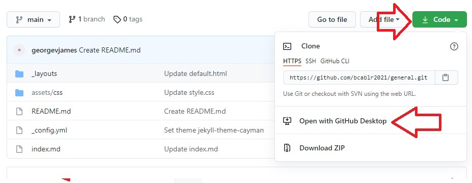
5. The github desktop app will open automatically, and the following screen will be presented. 
Make a note of the local path (the folder where your project files will be copied) and click `Clone` button.
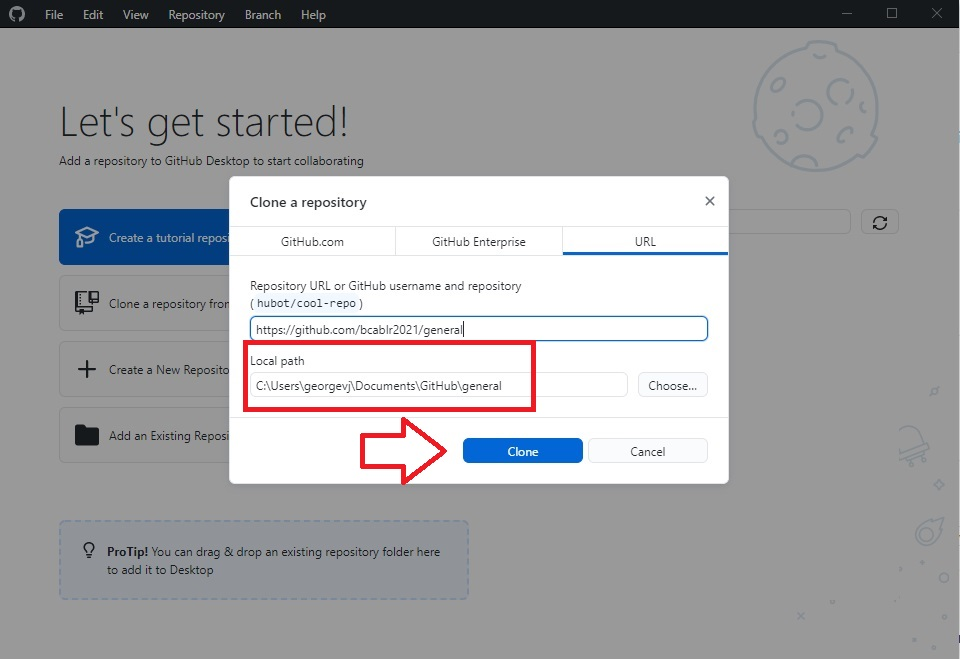
6. Click the 'Pull Origin' Button to download the files from the remote repository. This step may or may not be required. 
In case if you need to sync your local files with the remote, you can click do so by clicking the third button on below the 
menu bar, labelled 'Pull Origin' or 'Fetch origin'
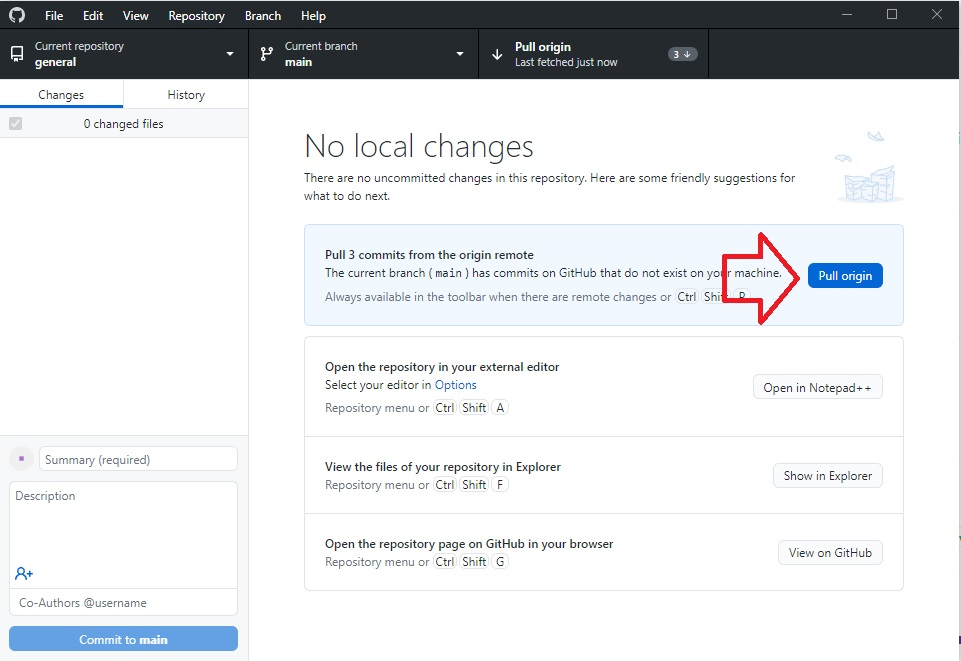
7. After that, create a new branch by following the secreenshots below.
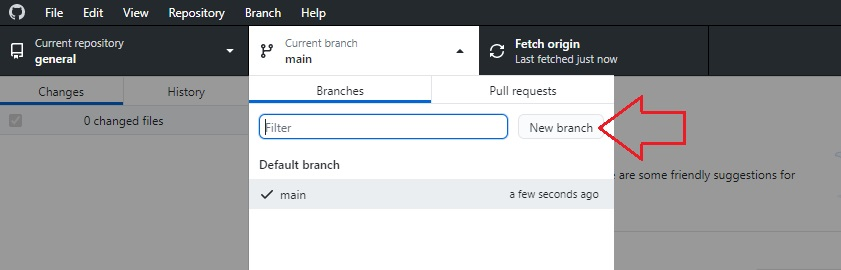
8. Give a meanigful name to your branch
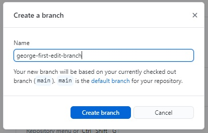
9. Publish the new branch to remote
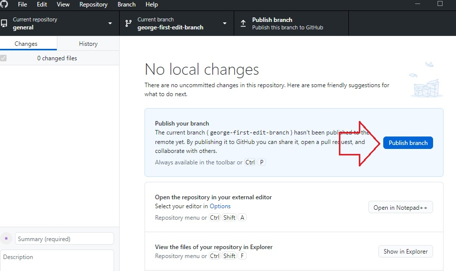
10. At this point, open your file explorer and go to the folder you noted down in step no. 5. 
11. Create a new subfolder, under the 'general folder'. Change the folder name to something unique, like your gitgub username.
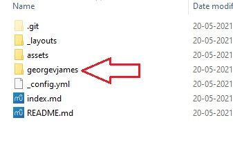
11. Open this newly created folder, and create a text file inside. Rename the file to `index.md`. 
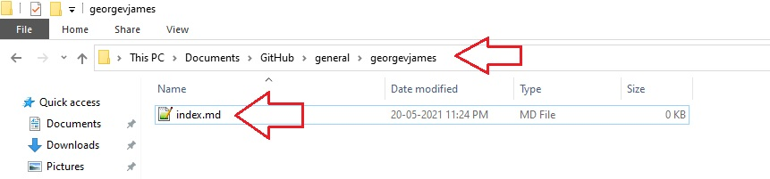
> Make sure that the extension of the file is not `.txt`. It must be `.md`
12. Edit this file using any text editor, and enter data in MarkDown format. You can also use HTML if you like to.
Use theis screenshot as a template. 
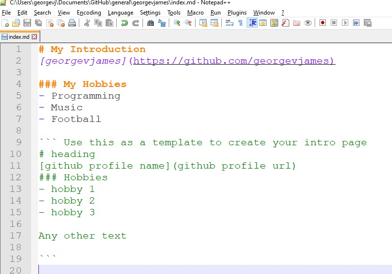
> This is a public site. Do not enter any personally identifiable information here. Also, do not put anything insane.
13. After saving the file, go back to the GitHub DeskTop App. If you see the following message at any time, select 
`Contribute to the parent project` and click `continue`. Otherwise continue to next step(s).
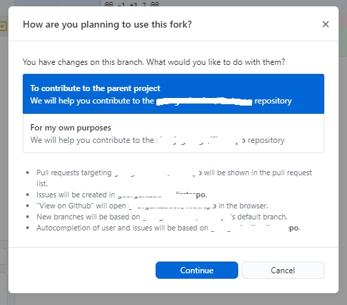
14. From the GitHub DeskTop App, select the index.md file you just created and click the **commit** button.
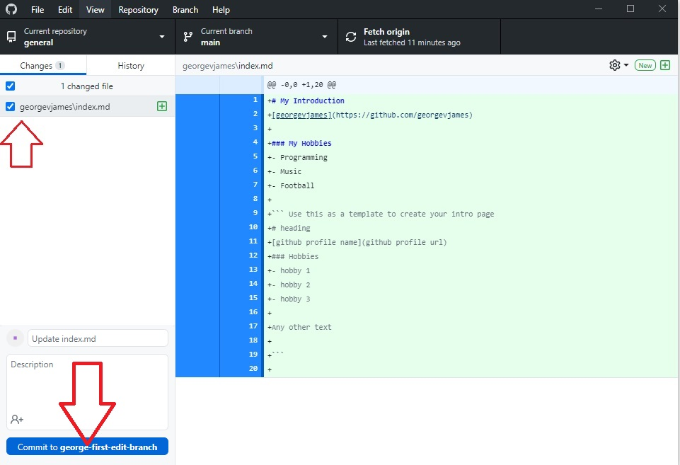
15. Click `push origin`
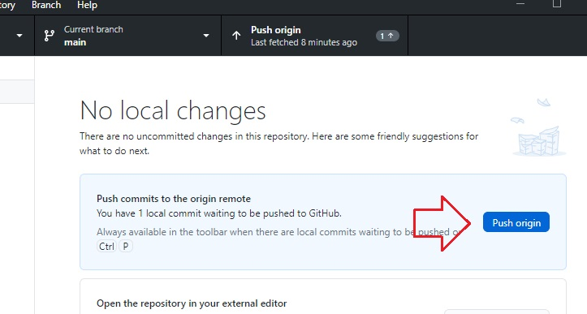
16. In the next screen, click `create pull request` button. This will open the github page in browser. Proceed to next step.
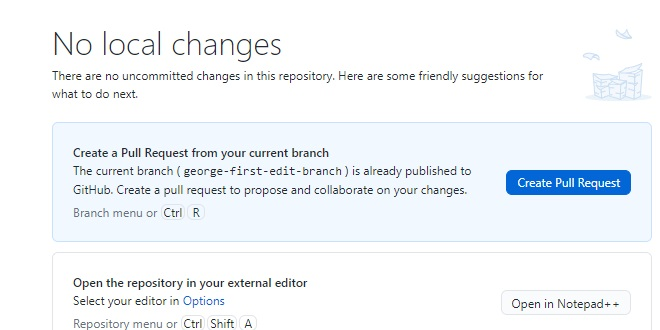
17. In the browser window, click `create pull request` button. And let the admin know!
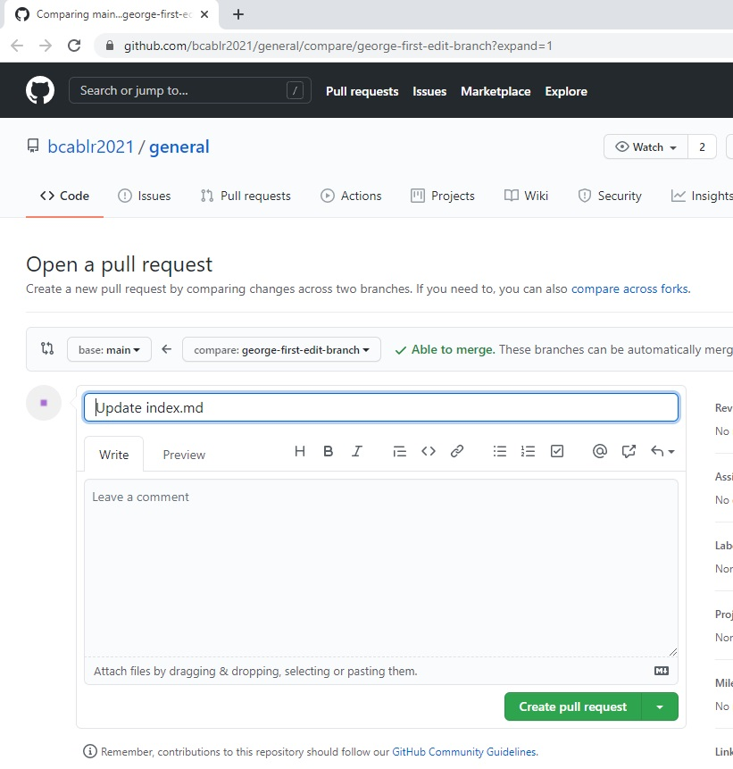
